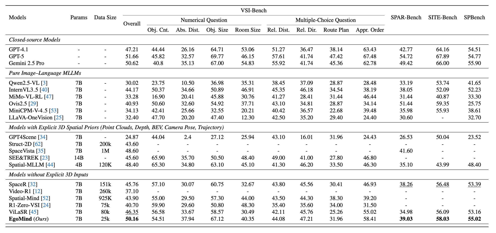

# EgoMind: Activating Spatial Cognition through Linguistic Reasoning in MLLMs

<p align="center">
    <a href="https://github.com/Hyggge/EgoMind"></a>
    <a href="https://arxiv.org/abs/2604.03318"></a>
    <a href="https://huggingface.co/Hyggge/EgoMind-7B"></a>
    
</p>

<p align="center">
<strong>Zhenghao Chen</strong><sup>1,2</sup>, <strong>Huiqun Wang</strong><sup>1,2</sup>, <strong>Di Huang</strong><sup>1,2✉</sup><br>
<sup>1</sup>State Key Laboratory of Complex and Critical Software Environment, Beihang University<br>
<sup>2</sup>School of Computer Science and Engineering, Beihang University<br>
</p>


## ✨ News
- **[2026.04.07]** 🎉🎉 We have released the [model weights](https://huggingface.co/Hyggge/EgoMind-7B) and the evaluation code!
- **[2026.04.01]** 🎉We have released our [paper](https://arxiv.org/abs/2604.03318) on arXiv!
- **[2026.02.21]** 🎉 Our paper has been accepted to **CVPR 2026**! 

## 🚀 Framework

EgoMind is a Chain-of-Thought (CoT) framework that enables **geometry-free spatial reasoning** through two key components:

- **Role-Play Caption (RPC)**: Simulates an agent navigating an environment from a first-person perspective, generating coherent descriptions of frame-wise observations and viewpoint transitions to build a consistent global understanding of the scene.
- **Progressive Spatial Analysis (PSA)**: First localizes objects explicitly mentioned in the query, then expands its attention to surrounding entities, and finally reasons about their spatial relationships in an integrated manner.

With only **5K auto-generated SFT samples** and **20K RL samples**, EgoMind achieves competitive results on VSI-Bench, SPAR-Bench, SITE-Bench, and SPBench, demonstrating the potential of linguistic reasoning for spatial cognition.

<p align="center">
  
</p>

## 🏆 Main Results

EgoMind achieves competitive performance among open-source MLLMs across four spatial reasoning benchmarks, using only 25K training samples (5K CoT-supervised + 20K RL) without any explicit 3D priors.

<p align="center">
  
</p>

## 🔬 Evaluation

### 1. Environment Installation

```bash
conda create -n egomind python=3.11 -y
conda activate egomind
pip install uv
uv pip install torch==2.6.0 torchvision==0.21.0 torchaudio==2.6.0 --index-url https://download.pytorch.org/whl/cu124
uv pip install -r requirements.txt
```

### 2. Dataset Preparation

Download the benchmark data and place them under `evaluation/datasets/`. See [evaluation/datasets/README.md](evaluation/datasets/README.md) for detailed instructions.

The expected directory structure:

```
evaluation/datasets/
├── VSI-Bench/
│   ├── qa_processed.jsonl
│   └── data/                  # arkitscenes/, scannet/, scannetpp/
├── SPAR-Bench/
│   ├── qa_processed.jsonl
│   └── data/                  # images/
├── SITE-Bench/
│   ├── qa_processed.jsonl
│   └── data/                  # ActivityNet/, MLVU/, MVBench/, ...
└── SPBench/
    ├── qa_processed.jsonl
    └── data/                  # SPBench-MV-images/, SPBench-SI-images/
```

### 3. Running Evaluation

All benchmarks share the same entry point `evaluation/run_eval.py`. Below are the commands for each benchmark.

**VSI-Bench**

```bash
python evaluation/run_eval.py \
    --model_path Hyggge/EgoMind-7B \
    --output_path outputs/vsibench.jsonl \
    --benchmark vsibench
```

**SPAR-Bench**

```bash
python evaluation/run_eval.py \
    --model_path Hyggge/EgoMind-7B \
    --output_path outputs/sparbench.jsonl \
    --benchmark sparbench
```

**SITE-Bench**

```bash
python evaluation/run_eval.py \
    --model_path Hyggge/EgoMind-7B \
    --output_path outputs/sitebench.jsonl \
    --benchmark sitebench
```

**SPBench**

```bash
python evaluation/run_eval.py \
    --model_path Hyggge/EgoMind-7B \
    --output_path outputs/spbench.jsonl \
    --benchmark spbench
```

**Calculate the metric using existing outputs only** (skip inference):

```bash
python evaluation/run_eval.py \
    --output_path outputs/vsibench.jsonl \
    --benchmark vsibench \
    --only_eval
```

## 📜 Citation

If you find our work helpful, please consider citing our paper:

```bibtex
@misc{chen2026egomind,
      title={EgoMind: Activating Spatial Cognition through Linguistic Reasoning in MLLMs}, 
      author={Zhenghao Chen and Huiqun Wang and Di Huang},
      year={2026},
      eprint={2604.03318},
      archivePrefix={arXiv},
      primaryClass={cs.CV},
      url={https://arxiv.org/abs/2604.03318}, 
}
```
